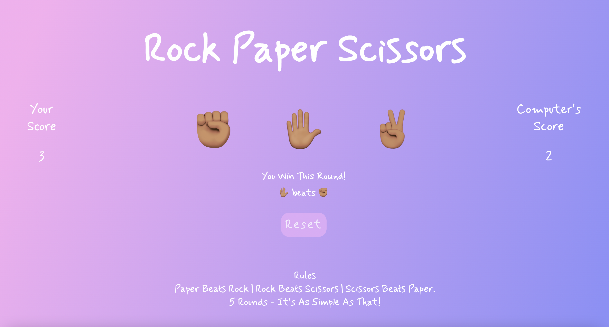

# Rock Paper Scissors
Who doesn't love the classic Rock Paper Scissors game? This project was created to practice creating functions, understand DOM manipulation, 
and build problem solving skills. It is the third project in TOP. 

I will create a second version soon once I learn more about advanced animations.

Update: Here is the [second version](https://bubblegumloco.github.io/rps-animations/)!

Will you conquer the computer? Test your fate ... 

# What I Learned 
  * Objects are composed of key-value pairs and each key-value pair is a property of the object 
    * This helped me to create rules by making each option in the game a key and the losing option as a value. Then, I could access each property 
    in the conditional statements 
  * Practiced using the debugger to place breakpoints and analyze the call stack to see the execution order of each part of my function
    * Initially, the player's choice was appearing as undefined so I had to rework my code to fix this issue 
  * Worked on manipulating DOM elements using methods such as .disabled, .querySelector(), .addEventListener() and added style properties in js specific to certain functions 
  * Learned about CSS properties such as ms-transform which allows transformations to be present on Internet Explorer and webkit transform which is for 2D and 3D shape transformations
  
# Preview

# Demo
🕹 [Rock Paper Scissors](https://bubblegumloco.github.io/RockPaperScissors/)
